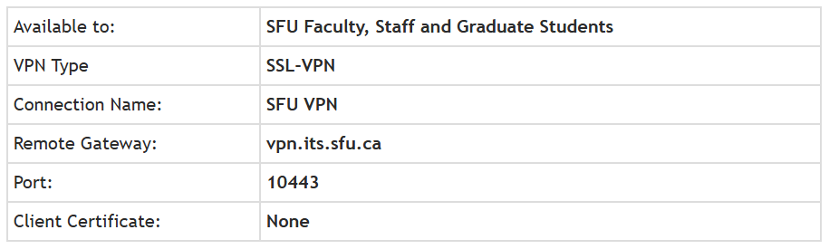

# Why VPN is crucial
A **VPN (Virtual Private Network)** is crucial because it protects your online privacy and security by encrypting your internet connection, hiding your IP address, and preventing unauthorized access to your data. It is especially vital when using public Wi-Fi, as it safeguards against hackers and cyber threats. Additionally, a VPN allows you to bypass geographical restrictions, access region-locked content, and avoid censorship, ensuring an open and secure internet experience.

 \
A youtube video explaining the functionalities of VPN can be viewed [**(here)**](https://youtu.be/CWy3x3Wux6o?si=Lld_PYizzgmw0iH3)

---

## The Minimum requirements for SFU VPN
- [Windows](https://docs.fortinet.com/document/forticlient/6.4.3/windows-release-notes/549781/product-integration-and-support)
- [Mac](https://docs.fortinet.com/document/forticlient/6.4.3/macos-release-notes/471180/product-integration-and-support)
- [Linux](https://docs.fortinet.com/document/forticlient/6.4.3/linux-release-notes/136392/product-integration-and-support)

---

## What is MFA?
Multi-Factor Authentication, or MFA for short is an authentication method that requires the user to provide two or more verification factors to gain access to a resource such as an application, online account, or a VPN.

---

## How does MFA work?
MFA works by requiring additional verification information (factors). One of the most common MFA factors that users encounter are one-time passwords (OTP). OTPs are those 4-8 digit codes that you often receive via email, SMS or some sort of mobile app. With OTPs a new code is generated periodically or each time an authentication request is submitted.

For more information click [(here)](https://www.fortinet.com/resources/cyberglossary/multi-factor-authentication)

---

## How to install SFU VPN
Referring to the official SFU website, you'll need the following to access SFU's VPN network
1. An SFU account (faculty, staff or graduate students) that is enrolled in SFU's Multi-Factor Authentication.
2. The free version of the FortiClient VPN app. See Install the Fortinet VPN App.
3. The connection settings listed below.

---

For additional information please refer to the official [**(SFU website)**](https://sfu.teamdynamix.com/TDClient/255/ITServices/KB/ArticleDet?ID=3973) 